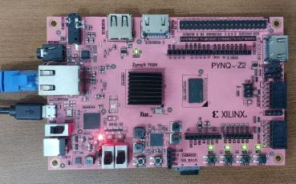
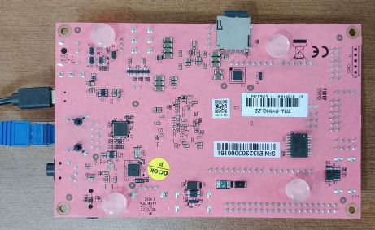

# 📘 FPGA Workshop

## 🧠 Overview

This repository contains the work completed during the FPGA workshop.  
Each day includes simple experiments using the **PYNQ-Z2** board, where switch inputs are read and results are shown on LEDs.

The workshop mainly focuses on:

* Basic logic gates
* Code conversion
* Adders and subtractors
* Multiplexer design

---

## 💻 Hardware Used

The main hardware used in this workshop is the **PYNQ-Z2 FPGA development board**.  

   
Basic hardware parts used in the experiments:

* PYNQ-Z2 board
* USB cable for power/programming
* Laptop with Jupyter / PYNQ environment

---

## 🔹 About The PYNQ-Z2 Board

The **PYNQ-Z2** is an FPGA development board based on the **Xilinx Zynq-7000 SoC**.  
It combines:

* A processor system (ARM-based processing)
* Programmable logic (FPGA)

This makes it useful for learning both hardware design and simple embedded control in one board.

For this workshop, the board is helpful because:

* switches can be used as inputs
* LEDs can be used as outputs
* Python can be used to interact with the hardware through PYNQ

---

## ⚙️ Basic Board Details

Some basic PYNQ-Z2 features are:

* 512 MB DDR3 memory
* MicroSD card support
* USB and Ethernet support
* Push buttons, slide switches, LEDs, and RGB LEDs

These features make the board suitable for beginner FPGA experiments and digital logic demonstrations.

---

## 📂 Repository Structure

* `Day 1` - Basic logic implementation
* `Day 2` - Logic operations and code conversion
* `Day 3` - Half adder, half subtractor, and multiplexer
* `Day 4` - Counter using LEDs and switches
* `Day 5` - Shift register using buttons and LEDs

---

## ⚠️ Notes

* Most programs run continuously using `while True`
* Stop running code using `Ctrl + C`
* The examples are designed for learning basic FPGA concepts using PYNQ

---
